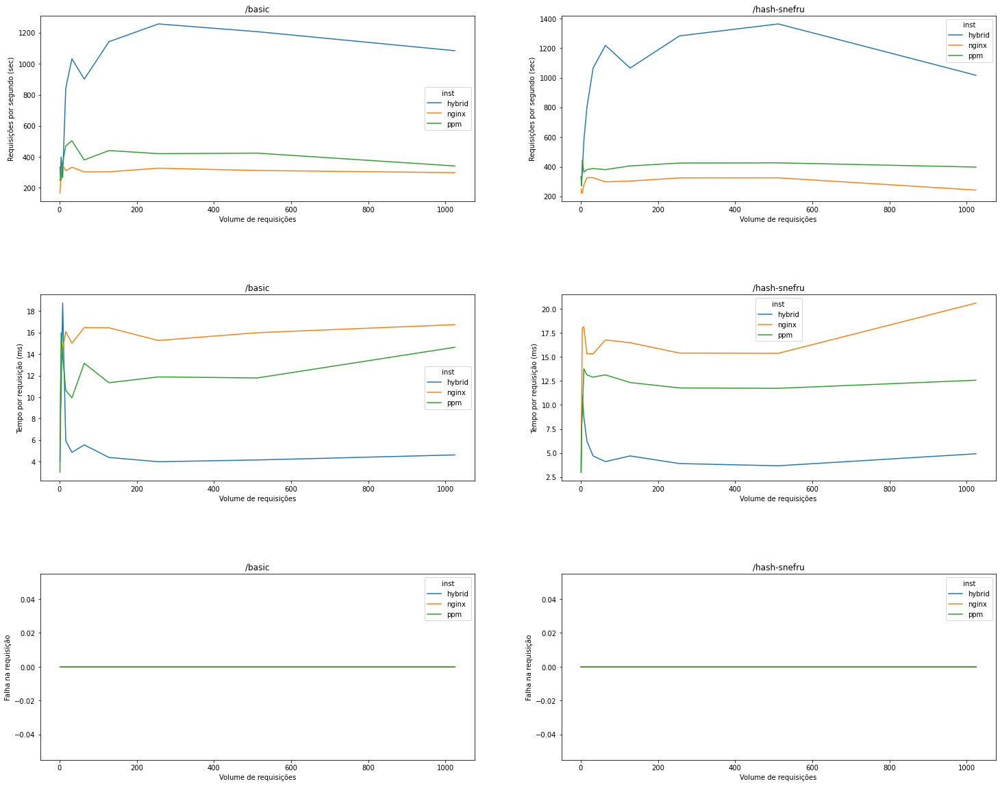
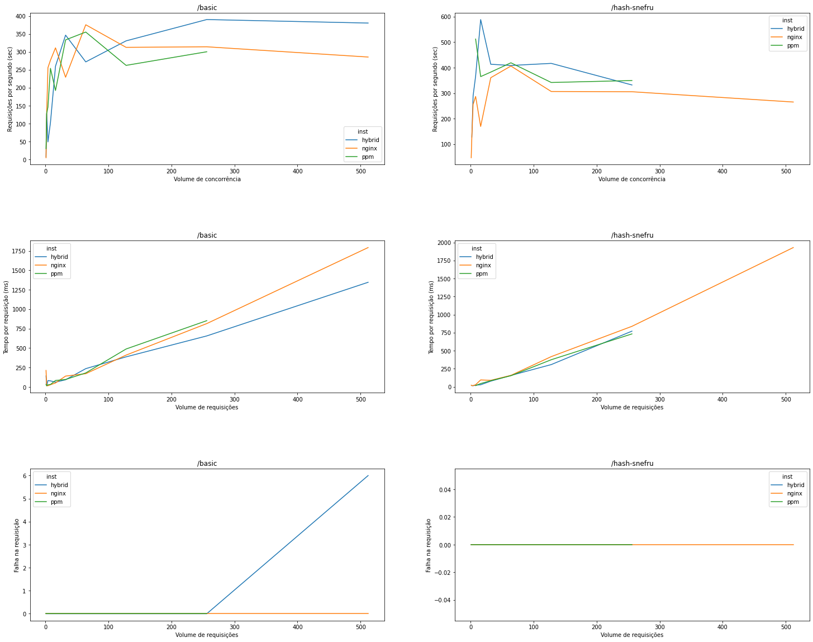

```shell

cd ./application && composer install && cd ../

docker build --pull --rm -f "docker/nginx/Dockerfile" -t benchmark:nginx "."
docker build --pull --rm -f "docker/hybrid/Dockerfile" -t benchmark:hybrid "."
docker build --pull --rm -f "docker/ppm/Dockerfile" -t benchmark:ppm "."


docker run --rm -d -p 81:80/tcp benchmark:nginx
docker run --rm -d -p 82:80/tcp benchmark:hybrid
docker run --rm -d -p 83:80/tcp benchmark:ppm

```

# Carga



# Concorrência


